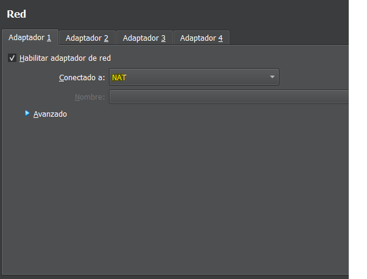
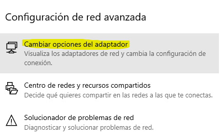

 # Redes (Marc Jorquera, Erick Gutierrez, Mario Fernandez)
 ### Indice
1. **Clasificación IP's**
2. **Qué IP se utilizan para servidores y qué ip para puertos de enlace.**
3. **Funcionalidad de las máscaras de red y cómo se calculan según la clasificación de IP's.**
4. **VLAN (qué es y para qué sirve, configuración en Packet Tracer)**
5. **Configuración de red en máquinas virtuales. Diferentes configuraciones de los adaptadores de red.**
6. **Configuración de red en windows.**
7. **Configuración de red en Linux (en Debian y Ubuntu 22.04).**

## Clasificación IP's
### Tabla de IP's
| Clasificación para direcciones IPv4:| Clase A                    | Clase B          | Clase C           |Clase D      |
|------------------                   |----------------------------|------------------|-----------------  |--------     |
|                         | Se inicia con un número entre 0.0.0.0 y 127.255.255.  | Se inicia con un número entre 128.0.0.0 y 191.255.255.255         | Se inicia con un número entre 192.0.0.0 y 223.255.255.255 |Se inicia con un número entre 224.0.0.0 y 239.255.255.255             |
|                            | Ejemplo 10.0.0.2 | Ejemplo 172.24.0.2       | Ejemplo 192.168.0.10 |               |
|                            | 192.0.0.0 - 223.255.255.255 | 192.168.0.10     | 110 en los tres primeros bits |            |
|                             | Empiezan con 0 en el primer bit            |Comienzan con 10 en los dos primeros bit            |     Comienzan con 110 en los tres primeros bits                      |    Comienzan con 1110 en los cuatro primeros bits            |

### Diferencia entre IPv6 
En IPv6, a diferencia de IPv4, ya no se utilizan clases, se dividen en segmentos específicos que tienen funciones diferentes.

1. **Prefijo de Red**: Se utiliza para identificar una red específica.

2. **Identificador de Interfaz**: Se utiliza para identificar de modo único una interfaz en la red. Por ejemplo, un dispositivo de red o una interfaz de red en un dispositivo.

3. **Tipos de Direcciones**:

* **Unicast**: Identifica una interfaz de red única.

* **Multicast**: Dirigido a múltiples interfaces.

* **Anycast**: Dirigido a uno de varios destinatarios posibles.

## ¿Qué IP's se utilizan para servidores y qué ip's para puertas de enlace?
+ **Ips para servidores**: Las direcciones IP de servidor son asignadas a los dispositivos o máquinas que proporcionan servicios o recursos a la red , se utilizan para identificar los servidores y otros recursos como impresoras de red, dispositivos de almacenamiento y dispositivos de red que ofrecen servicios como DNS, DHCP, correo electrónico, servicios web, etc

Estas direcciones pueden ser públicas o privadas, dependiendo de si están destinadas a ser accesibles desde Internet o sólo en la red local.

+ **Ips para puertas de enlace**: Son las direcciones utilizadas por los dispositivos de red que actúan como puntos de acceso entre la red local y otras red, como Internet, Normalmente, la puerta de enlace es la dirección IP del router utilizado para conectarse a Internet o a otras redes.

Son herramientas de seguridad que se utilizan para monitorear y proteger el tráfico de red.

Algunas IPS para puertas de enlace utilizadas comúnmente incluyen:Firewalls de nueva generación (NGFW):, Sistemas de detección y prevención de intrusiones (IDS/IPS), Aplicaciones y dispositivos de seguridad de red y Soluciones de seguridad en la nube.

## Funcionalidad de la máscaras de red y cómo se calculan según la clasificación de IP's.
Las máscaras de red son utilizadas en las direcciones IP para dividir las redes en subredes o agrupar múltiples redes en una red más grande. El formato y la longitud de la máscara de red varían según la clasificación de las direcciones IP (IPv4 o IPv6).

La máscara de red se calcula de acuerdo con la clase de dirección IP que está utilizando y la cantidad de bits que se asignan para identificar la red y los dispositivos en esa red.

## VLAN (qué es y para que sirve, configuración en Packet Tracer)
Es una tecnología que sirve para dividir una red de computadoras en grupos más pequeños y separados de manera lógica, aunque estén físicamente conectados a la misma red física. Esto se hace para mejorar la seguridad, el rendimiento y la administración de la red.

## Configuración de red en máquinas virtuales. Diferentes configuraciones de los adaptadores de red.

* **Adaptador de red de tipo puente  (Bridge Adaparter)**:
  Este permite tener una **IP** en la maquina virtual propia y otra en la maquina fisica, en la misma red. 

  

* **Adaptador de red NAT (Network Address Translation)**: En este modo, la máquina virtual utiliza la dirección IP del host para todas las comunicaciones con la red externa. El hipervisor realiza el direccionamiento NAT.   

* **Adaptador de red interna (Internal Network)**: En este modo puede comunicarse con maquinas virtuales en la misma maquina fisica, pero no tienen acceso a la red.

* **Modo Nat (Network Address Translation)**: Este modo comparta la direccion IP del host para acceder a la red externa, generalmente a Internet.  

## Configuración de red en Windows
Para poder configurar la **IP** tenemos de ir al escitorio y luego le damos al icono de **Ethernet**.

Luego le damos a **Abrir Configuración...** y accedemos.

Luego le damos **Cambiar opciones del Adaptador**, accedemos

Luego damos click derecho en el adaptador de red, ya sea wifi o Ethernet y le damos en **Propiedades**.

Luego le damos doble click a **IPv4**.

Y cambiamos  la **IP**, **Mascara de subred**, **Puerta de enlace** y **El DNS**.

Para ver la configuracion, abrimos el **CMD** y ponemos el comando **ipconfig /all**.

## Configuración de red en Linux (Debian 16.04).
Para poder configurar la direccion **IP**, abrimos el **Terminal** y ponemos el comando **sudo nano /etc/network/interfaces/**. 

Luego accedemos y ponemos: 
+ **auto enp0s3**
+ **iface enp0s3 inet static**
+ **address 192.168.1.24**
+ **netmask 255.255.255.0**
+ **gateway 192.168.1.1**

Lo guardamos usuando **Crtl + o**

Luego ponemos este comando, para resetear la configuración IP y se ponga correctamente **sudo service networking restart**.

Luego ponemos este comando **ifconfig** para ver la configuración IP de la red.

## Configuración de red en Linux (22.04).

Para poder configurar la direccion **IP**, abrimos el **Terminal** y ponemos el comando **sudo nano /etc/netplan/99-config.yaml**. 

Luego accedemos y ponemos: 
+ network:

  + version: 2

  + renderer: networkd

  + ethernets:
    + eth0:
      + addresses: [192.168.1.25/24]
      + gateway4: 192.168.1.1
      + nameservers:
        + addresses: [8.8.8.8, 8.8.4.4]

Lo guardamos usuando **Crtl + o**

Luego aplicar el **netplan apply**

Para renovar la dirrecion IP a traves de DHCP. **sudo dhclient -r** y **sudo dhclient**

Y resteamos la IP con el comando **sudo systemctl restart systemd-networkd**.

